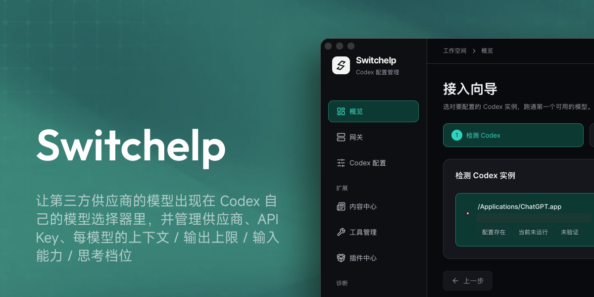
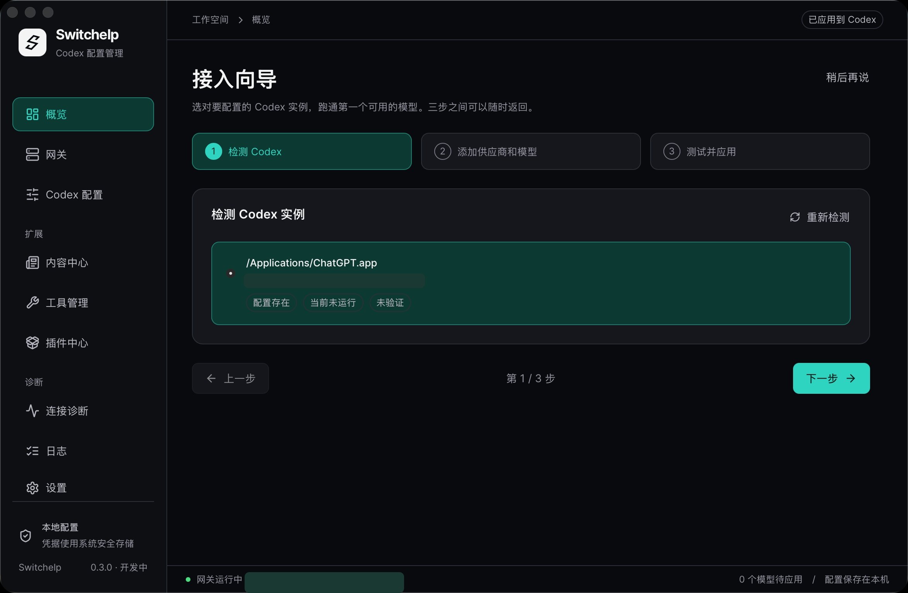

# Switchelp

[English](README.md) · **简体中文**

让第三方供应商的模型出现在 **Codex 自己的模型选择器**里，并管理供应商、API Key、每模型的上下文 / 输出上限 / 输入能力 / 思考档位。

本机 macOS 配置工具。Tauri 2 + React 18 + TypeScript 外壳，业务判定全部在一个不依赖窗口框架的 Rust 核心（`crates/switch-core`）里。



## 它怎么工作

```
Codex  →  ~/.codex/config.toml（本工具受管字段）
       →  model_providers.gptswitch → 本机网关 127.0.0.1:18765
       →  auth helper 取本机令牌 → 按 alias 路由到供应商 → 上游
```

- **模型菜单**来自编译后的目录文件（`model_catalog_json`），不是本工具自绘的列表。注意 `model_catalog_json` 是**整体替换**宿主的模型列表而不是追加：工具处于已应用状态时，原生模型不在选择器里，要「还原为原生 Codex」才会回来。
- **共存模式（Bridge）**让菜单里同时保留官方模型。它不改你真实的配置，而是在应用数据目录里写一份托管 profile，并通过 `gptswitch-bridge` 启动 Codex：那个 bridge 起两根 codex（你那根原样不动、托管那根读我们写的配置），合并 `model/list` 与 `thread/list`，并把每个会话钉在它当初所在的那根上。目前只有 macOS 装配完整；它由本应用启动宿主时生效（自己从 Dock 重开 Codex 会回到纯原生，界面会如实告诉你）。

- 上游是 `chat/completions` 时由网关双向翻译成 Responses；无法表达的字段**明确记为损失**，不假装生效。
- **界面中英双语**：默认跟随系统语言，可在「设置 → 外观与语言」里固定为简体中文或 English，切换立即生效并记住。两套文案的键集合由 `src/i18n.test.ts` 守住，缺一条就失败，不会静默回退成中文。

## 下载与安装

| 平台 | 下载 | 安装方式 |
| --- | --- | --- |
| macOS（Apple Silicon） | [下载 DMG](https://github.com/nexsjournal/switchelp-macapp/releases/download/v0.3.3/Switchelp_0.3.3_aarch64.dmg) | 打开 DMG，把 `Switchelp.app` 拖进 Applications |
| Windows（x64） | [下载安装程序](https://github.com/nexsjournal/switchelp-macapp/releases/download/v0.3.3/Switchelp_0.3.3_x64-setup.exe) | 运行 NSIS 安装程序并按提示完成安装 |

所有构建都在 [Releases](https://github.com/nexsjournal/switchelp-macapp/releases) 上，含更早的版本。

**首次打开（macOS）**：包已用 Developer ID 签名，但尚未公证，所以系统会拦一次。打开**系统设置 → 隐私与安全性**，在「安全性」一栏点被拦截应用旁边的**仍要打开**，再输入密码确认。或者打开一次终端执行：

```bash
xattr -dr com.apple.quarantine /Applications/Switchelp.app
```

**Windows**：安装包是预览版。能装能开，但**不会写入配置**，并会说明原因——凭据 helper 在 Windows 上尚未实现。

**说明**

- **Intel Mac**：请从源码构建（`pnpm exec tauri build`）。
- **应用标识**：0.1.0 仍是旧的 `GPTSwitch` 名；应用标识仍是 `app.gptswitch.desktop`（有意保留，让旧版本的应用数据与凭据继续可用）。

## 构建与验证

```bash
pnpm install
pnpm typecheck && pnpm test          # 前端：类型 + 单元测试
cargo test -p switch-core            # 核心：集成 + 单元测试
pnpm exec tauri build --debug --bundles app
```

端到端验收（真实应用 + 真实网关 + 真实 Codex，上游为本地 mock）：

```bash
pnpm exec tauri build --debug --bundles app
node scripts/g0/probe-full-loop.mjs
```

发布或推送前跑一次隐私扫描（规则是通用的，脚本本身不含任何个人标识；
把你自己的私有特征写在仓库外的 `~/.switchelp-private-patterns` 里即可一并检查）：

```bash
printf '%s\n' 'api.your-provider.example' > ~/.switchelp-private-patterns
scripts/check-publish-safety.sh
```

## 安全边界

| 项 | 做法 |
| --- | --- |
| 上游 API Key | 只写系统凭据库（macOS Keychain / Windows 凭据管理器），**永不写入 `config.toml`**；SQLite 只存引用与掩码 |
| 本机网关 | 只绑 `127.0.0.1`；每次启动重新生成令牌；拒绝带 `Origin` 与浏览器预检的请求 |
| 配置写入 | 计划 → 校验 → 原子替换；应用失败会回滚，成功最多到「等待宿主重载」，不自行宣称已加载 |
| 诊断日志 | 只按白名单取字段名，值再过一道脱敏，保存前先预览；无遥测、不记请求正文 |

## 当前状态

机制层面已经端到端跑通，并且**已在 macOS 上用真实第三方供应商验证过**：真实上游返回了一次经本机网关路由的完整推理，`model/list` 能列出受管模型，`chat` 协议适配、输出上限、思考档位与模态拒绝都以真实上游收到的请求参数为证。

**应用之前值得先读的一条**：`model_catalog_json` 是**整体替换**宿主的模型列表——工具处于已应用状态时，原生模型从 Codex 选择器里消失，只有「还原为原生 Codex」才能拿回来。

**未验证**：Desktop 图形界面选择器的**视觉**表现（上面的证据来自 app-server 与日志层，不是看着那个菜单得出的）、Windows 真机、读屏实际表现。

设计与调研文档在 [`docs/`](docs/README.md)，含证据等级与未决问题清单（目前只有中文）。

以 [MIT 许可证](LICENSE) 发布。
