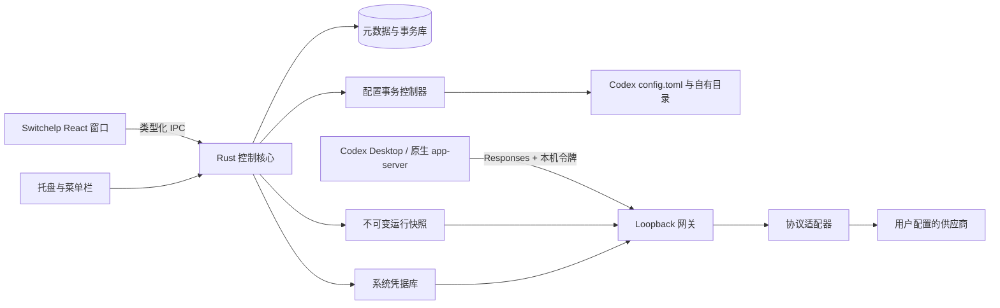

# 总体架构与技术决策

## 1. 推荐技术栈

| 层 | 选择 | 原因与约束 |
| --- | --- | --- |
| 桌面壳 | Tauri 2 | 一套界面覆盖两平台，Rust 核心、托盘、系统能力；WebView 差异需实测 |
| 界面 | React + TypeScript + Vite | 表单、组件与业务状态可测试；本地应用无需 SSR |
| 样式 | CSS variables + CSS Modules | 直接实现参考黑灰风格，不引入第二套主题；不强制 Tailwind |
| 交互基元 | Radix 可访问组件 | Dialog/Popover/Select 的焦点与键盘行为；用项目 tokens 定制 |
| 图标 | Lucide，离线按需打包 | 统一线性图标，见设计规范 |
| 后端 | Rust + Tokio | 文件、凭据、进程与网关放在可信核心 |
| HTTP | Axum + Reqwest + rustls | 本地 Responses 服务与上游请求；流式取消/背压必须覆盖 |
| 元数据 | SQLite，版本化 migration | 多实体、应用事务、历史与结构化诊断；不存明文 Key |
| TOML 修改 | `toml_edit` | 保留注释和未知项，避免正则删除整段 |
| 系统凭据 | macOS Security / Windows Credential Manager 适配器 | 可用成熟 Rust 封装，但需验证实际后端及错误语义 |
| 契约 | Rust serde 类型 → 生成 TS 类型/JSON schema | 单一类型源，前后端共同校验 |
| 测试 | Rust 单元/集成，Vitest，浏览器组件测试，真机验收 | Tauri 平台与 Codex 菜单不能只靠浏览器测试 |

版本号在 G0 后锁定到 lockfile，不复制参考项目版本作为“最新”。Tauri 的 Rust 与系统 WebView 架构来自官方资料，性能预算是本项目目标。[Tauri 官方概览](https://v2.tauri.app/start/)

### 2026-09-18 桌面壳复审

当前仍以配置管理、网页使用系统浏览器打开为基线，保留 Tauri 2。用户补充的星算助手开发者反馈表明，对方因内嵌浏览器成本从 Tauri 迁移到 Electron；本机安装包也已确认是 Electron + Rust core-host。

若本产品确定要做高频内嵌控制台、多标签或独立网页登录会话，应在 G1 前优先切换 **Electron + Rust core-host**，不必等到 Tauri 无法实现。具体比较、触发条件和备选进程架构见 [桌面壳选型复审](../research/03-desktop-shell-decision.md)。Codex 菜单/路由接入与桌面壳分开验证，换壳不代替修复配置一致性。不同时维护两套壳；Swift/AppKit + Windows 原生双栈仍不符合当前范围。

### CodexSplit 技术栈复核对本方案的影响

CodexSplit 公开 macOS 源码采用 **SwiftUI/AppKit → WKWebView → 本地 HTML/CSS/JavaScript Dashboard → TypeScript/Node.js 后台**。`DashboardView.swift` 创建系统 WKWebView；`GatewayProcess.swift` 启动随包 Node 并让页面加载本机 `/dashboard`。Node 在这里承担后台服务，不是 Electron 桌面壳。[界面承载源码](https://github.com/AITabby/codexsplit/blob/6cab7ed6fe1d2ad910aa7fef3128e67669221604/macos-app/Sources/OpenCodex/DashboardView.swift)、[后台启动源码](https://github.com/AITabby/codexsplit/blob/6cab7ed6fe1d2ad910aa7fef3128e67669221604/macos-app/Sources/OpenCodex/GatewayProcess.swift)

本项目借鉴其界面组织和模型接入的职责划分，保留 Tauri 跨平台壳与 Rust 核心。原因是目前需求集中在配置、凭据、模型能力和网关；没有确定要把供应商网站作为应用内浏览器长期使用。黑灰视觉和流畅表单不依赖特定桌面壳。若直接照搬其 Swift 壳，仍需另行实现 Windows 壳；该项目 Windows 仅发布 EXE，公开源码不足以确认其技术栈。

模型菜单接入单独验收：模型目录决定向宿主声明哪些模型与能力，网关决定请求实际发往哪个供应商，宿主运行状态决定何时加载这些设置。更换 Electron 不会自动消除这三者之间的状态差异。完整代码链路及参考项目边界见 [CodexSplit 调研](../research/01-reference-projects.md#3-codexsplit)。

## 2. 系统边界

官方原生模式走 Codex 原有路径。上图只描述第三方模式，不能暗示官方 OAuth 凭据必须流经网关。

## 3. 模块划分

| 模块 | 责任 | 禁止承担 |
| --- | --- | --- |
| ProviderService | URL、元数据版本、多 Key（含备注名与停用） | 直接改 Codex 配置 |
| CredentialService | Key 保存/替换/解析、掩码、撤销 | 返回完整旧 Key 给 UI |
| ModelService | 精确 ID、能力证据、目录选择 | 从名称猜功能并自动启用 |
| CatalogCompiler | 将已选择模型编译到版本化宿主目录 | 探测上游或保存凭据 |
| ConfigPlanner | 读取配置层、所有权、差异与影响范围 | 隐式执行计划 |
| ApplyCoordinator | 校验、锁、提交、回滚、恢复 | 周期性强制对齐用户设置 |
| RuntimeRegistry | 路由快照、版本引用、活跃请求 | 持有 UI 草稿 |
| Gateway | 鉴权、路由、限流、流式转发 | 管理 UI、任意文件操作 |
| ProtocolAdapter | 无副作用的消息/字段/事件转换 | 自动换 Key、重启进程 |
| CodexAdapter | 版本检测、配置投影、加载验证 | 读取/重写会话正文与历史库 |
| PlatformService | OS 路径、凭据、启动、托盘 | 模型业务策略 |
| Diagnostics | 阶段结果、脱敏日志、诊断包 | 将日志当成路由事实源 |

依赖方向：UI → DesktopClient → 壳的 IPC 适配 → 应用用例 → 领域类型/策略；具体 OS、DB、HTTP 是适配器。初版用一个 Rust workspace，核心为独立 `switch-core` library crate，不依赖 Tauri 的 State、AppHandle 或事件类型；`src-tauri` 只保留装配和壳适配。不照搬 Prodex 数十个 crate，也不提前实现 Electron core-host。

React 业务组件只依赖类型化 DesktopClient；Tauri invoke/listen 集中在 transport 文件。窗口与托盘留在壳，OS 文件、凭据、进程能力通过独立平台接口提供。命令 DTO、错误和事件沿用现有契约；壳转换不得改变业务语义。

参考 [DSH 桌面壳研究](../research/04-dsh-reference.md)，增加 `DesktopSession` 作为窗口、托盘和监听器的资源所有者，释放幂等；平台窗口差异由壳适配集中处理。它只管 UI 生命周期，不拥有配置 Revision，也不能因窗口恢复自动应用模型。

## 4. 进程生命周期

初版网关运行在 Tauri Rust 主进程的异步任务中。窗口关闭仅隐藏窗口，托盘继续服务；“退出 Switchelp”需要告知第三方调用将中断，默认等待当前请求结束，不自动强杀 Codex。

单实例锁按“OS 用户 + 应用数据目录”建立。控制 IPC 不开放 HTTP 管理接口。网关首次选择一个空闲 loopback 端口，保存为实例设置，后续固定使用；端口被别的进程占用时提示冲突，不能自动杀进程或悄悄换端口使 Codex 失联。

共存模式（Bridge）已实现，编译为自有独立可执行文件 `gptswitch-bridge`（`crates/bridge`，随包分发、启动时装到应用数据目录）。只给受管 Desktop 子进程设置路径和环境（`CODEX_CLI_PATH` 等，见 [配置生命周期](02-configuration-lifecycle.md) 的共存模式一节），不改变全局 `launchctl`、用户 PATH 或系统注册表环境变量。桥接未知消息默认透明转发，stderr 只记形状不记内容（握手里有账号凭据），stdout 严格保留协议。它起两根真 codex：原生那根用用户真实的 `~/.codex`，托管那根用应用数据目录里的第二个 `CODEX_HOME`；合并 `model/list` 与 `thread/list`，并按线程把会话钉在对应那根上。

## 5. 状态与一致性

唯一业务真相是 SQLite 中的已保存实体和发布版本。目录文件、TOML 片段与运行快照是生成产物；Codex 缓存属于宿主，不是本项目业务数据库。

每次应用生成 `Revision`：供应商、模型、凭据引用、目录 schema 版本和配置摘要。请求开始时持有不可变 Revision；中途 UI 保存不会更换其上游。旧版本在引用计数归零、续接 TTL 过期后清理。

宿主请求必须能证明自己使用哪个目录版本，不能仅用同名 alias 查“最新配置”。目录级修改为目标实例生成带 `instanceId/catalogRevision` 的 Base URL；网关按该路径选择兼容路由集合。相同目录能力下的 Key 选择与输出策略热更新独立发布为 policyRevision，请求入站后一次性捕获。旧宿主未重载仍使用旧目录路径，不会突然获得不兼容的新模型能力。首发界面一次只管理一个活动目标，核心仍保留实例隔离。

区分四种修订：草稿版本、已发布网关版本、已提交配置版本、已观测宿主版本。只有需要的层全部一致时，UI 才显示“已加载”；测试请求提供额外的“已验证路由”证据。

## 6. 架构决策记录

| ADR | 决策 | 代价 / 复审条件 |
| --- | --- | --- |
| 001 | 全部第三方模型统一网关 provider | 需常驻；避免每次 Key/上游切换改宿主 |
| 002 | 首选官方配置和目录，不依赖缓存改写 | 菜单热刷新受限；需要同菜单共存时用 010 的 Bridge |
| 003 | 一个稳定 alias 对应一个供应商模型身份 | 名称可读性由 display_name 解决，不能模糊按模型名路由 |
| 004 | 官方订阅原生模式独立 | 两种模式都保留：替换菜单（写原生配置）与共存（写托管 profile，见 010） |
| 005 | 不静默降级能力或换供应商 | 某些请求会明确失败，换取可解释性与正确性 |
| 006 | 字段级配置所有权与冲突处理 | 实现比整文件覆盖复杂，但可保护用户配置 |
| 007 | 默认固定 Key | 高可预测性；自动 failover 延后且有提交边界 |
| 008 | 不捆绑 Codex 二进制 | 用户先安装受支持 Codex；版本漂移需检测 |
| 009 | 当前 Tauri，核心与壳解耦 | 若内嵌浏览器成为高频产品能力，G1 前优先复审为 Electron + Rust core-host |
| 010 | 同菜单共存走进程级 Bridge（两根 codex + 按线程路由） | 多一次进程与一份托管 home；`model_provider` 是进程级配置，这是唯一能同时满足「菜单里能选」与「请求真能路由」的做法 |

## 7. 性能与演进

请求热路径只查内存快照，不逐 Token 读 SQLite 或 Keychain；凭据短时缓存在 Rust 内存，退出/锁定/轮换按策略清除。日志异步有界队列，满时丢弃低等级日志并统计，不能阻塞 SSE。能力发现和健康探测按用户动作启动，后台轮询默认关闭。

先对 Responses 透传做好，再扩大协议；先证明两个平台的真实菜单行为，再做更多模板、品牌图标和导入工具。
