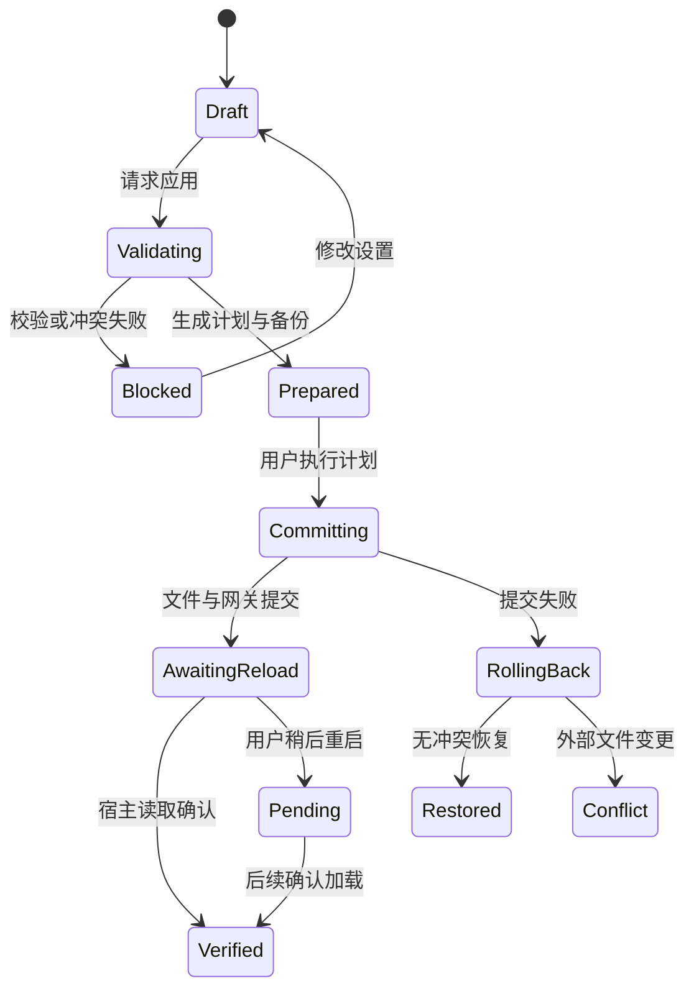

# 配置生命周期、应用与恢复

## 1. 配置根目录与优先级

每个 Codex 安装实例单独记录：应用路径、内置 CLI 路径、版本、实际 `CODEX_HOME`、启动方式、已选 profile、工作目录和权限状态。不能把终端进程中的 `$CODEX_HOME` 自动视为 GUI 实例的值。

先检测默认 `~/.codex` / `%USERPROFILE%\.codex`，再读取受支持实例可确认的覆盖。界面始终显示目标路径，用户可手动指定。Windows 与 WSL 配置根是不同目标；首发只管理原生 Windows，WSL 不自动合并。

Codex 的 CLI 参数、profile、用户配置、项目配置与管理员要求可能共同影响结果。适配器通过 `config/read`（指定 cwd、includeLayers）及目标版本规则解释有效值，不自行维护一套永远正确的硬编码优先级。管理员约束造成不可写时显示原因，不绕过。全局应用不顺带写所有项目 `.codex/config.toml`。

## 2. 本工具的字段所有权

| 对象 | 本项目权利 |
| --- | --- |
| 应用自己的 SQLite、目录快照 | 完整管理，版本化 |
| 用户 config 中 `model`、`model_provider`、`model_catalog_json` | 仅在应用计划声明后管理，记录原始存在性和值 |
| `[model_providers.gptswitch]` | 仅在未被他人占用或明确接管后管理 |
| 上下文、压缩、默认推理全局项 | 默认不设置；用户选择覆盖时才纳入事务 |
| MCP、skills、hooks、permissions、projects、sandbox 等 | 保留，不能清理或重置 |
| `auth.json`、系统官方账号凭据 | 不写入、不备份完整内容 |
| 会话、历史、索引数据库 | 不读取正文、不修改 |
| `models_cache.json` | 默认只作为诊断线索，不写 |

未知 TOML 项、注释、引号和换行尽可能保持。使用语法树/保真编辑器，解析失败立即停止。不能用正则全局删除所有 `model_catalog_json` 或同名 provider。

## 3. 配置投影示例

以下是未来生成器的说明示例，不是要求用户现在执行的配置。路径、端口、alias 和 helper 支持必须由目标实例探测。

```toml
model = "gs/p_demo/m_code"
model_provider = "gptswitch"
model_catalog_json = "/absolute/app-data/catalogs/rev_0007/models.json"

[model_providers.gptswitch]
name = "Switchelp"
base_url = "http://127.0.0.1:18765/i/local-main/c/rev_0007/v1"
wire_api = "responses"

[model_providers.gptswitch.auth]
command = "/absolute/path/gptswitch-auth"
args = ["--instance", "local-main"]
timeout_ms = 5000
refresh_interval_ms = 300000
```

示例 18765 不是强制端口。Windows 使用 TOML 正确转义的绝对路径。auth helper 只输出本机网关访问令牌，不输出供应商 Key。旧宿主不支持 command auth 时，受管启动使用 `env_key` 注入本机令牌；若用户坚持非受管启动且无法安全提供认证，显示“不支持该启动方式”，不默默把上游 Key 写入 TOML。官方说明指出 command auth 与其他认证字段互斥。[高级配置](https://developers.openai.com/codex/config-advanced/)

路径中的实例和目录版本由核心生成并与令牌权限匹配，不能由请求中的模型名覆盖。Key/兼容请求策略的热更新不改变该目录路径；目录能力变化才创建新路径并要求宿主重载。已知旧路径在仍有客户端/续接引用时保留，过期后返回明确的版本失效错误，绝不静默转向最新版本。

## 4. 变更影响分类

| 变更 | 网关发布 | 宿主重载 | 作用范围 |
| --- | --- | --- | --- |
| 供应商备注 / Key 标签 | 不需要 | 不需要 | 本工具 UI |
| 固定 Key 更换 | 需要 | 通常不需要 | 新请求，续接保持旧绑定 |
| 相同模型输出请求上限 | 需要 | 不需要 | 后续请求；显示实际生效值 |
| 供应商 URL / 协议改变 | 需要 | 菜单能力变更时需要 | 必须重新测试；已有续接不迁移 |
| 新增/删除目录模型 | 需要 | 启动时目录通常需要 | 合并到一次应用 |
| context / input / reasoning 目录变化 | 需要 | 通常需要 | 防止宿主旧能力与新策略混用 |
| Codex 默认模型 | 配置提交 | 视宿主版本和任务类型 | 默认只影响新任务 |
| 恢复原生 | 停止接管新请求 | 通常需要 | 保留官方登录和历史 |

“通常”由兼容矩阵替换为具体实例结果。UI 从计划计算“立即生效 / 需重新加载 / 仅影响新任务”，不自己猜。

## 5. 应用状态机



没有真实宿主回执时最多到 `Pending`，不能借重启命令返回 0 宣称 `Verified`。重试沿同一 operationId 继续，从最后持久化阶段恢复。

## 6. 提交算法

1. **读取**：解析目标配置；记录原始 bytes hash、文件身份、权限、配置层与安装版本；提取脱敏预览。
2. **验证**：模型能力一致性、路由唯一性、Key 引用存在、目标 schema、端口归属与其他管理器冲突。在线测试过期与否单独显示，保存本身不发请求。
3. **计划**：产生不可变 `ApplyPlan`，含目标、diff、expectedHash、revision、需要的重载范围、恢复入口。计划有 TTL，过期重算。
4. **准备**：凭据新版本先入库；新目录写入本工具修订目录，临时文件写完后 flush；保存私有原始备份与事务 journal。备份可能包含用户原文件中的秘密，不能当普通日志导出。
5. **加锁重读**：获取实例级锁和配置路径锁，再检查 hash 与文件身份。锁只能协调本工具，无法锁住不合作的编辑器，因此仍需最终 CAS 检查。
6. **提交**：网关先准备新版本但保留旧版本可用；目录用不可变路径；配置使用同目录临时文件 + 平台原子替换；DB 记录 committed revision；最后发布新请求默认版本。
7. **重载**：如需重载，先检查受管 Codex 的任务活动；忙时允许稍后应用，不按进程名批量 kill。用户选择重启时关闭目标实例，优雅退出并等待。
8. **核验**：检查文件摘要、网关版本、宿主模型目录与实例加载状态；路由测试另记测试结果。
9. **完成**：journal 记录结果，释放锁；旧目录和凭据保持到活跃引用结束。

SQLite 事务不能跨文件系统提供原子性。这里用预备阶段、不可变目录、原子切换单个配置文件与可恢复 journal 构成补偿事务。POSIX rename / Windows ReplaceFile 类操作仍有文件占用、权限和崩溃窗口，必须故障注入验证。

## 7. 崩溃恢复

启动时只恢复本工具未完成的事务，不自动重新配置全部供应商。

| 停机位置 | 恢复策略 |
| --- | --- |
| Key 已保存，元数据未提交 | 标记孤立新引用，保留短期恢复窗口再清理 |
| 目录已生成，配置未切换 | 保持旧配置，清理未引用目录 |
| 配置已替换，DB 未记完成 | 对比文件 hash 和 journal，补记完成或回滚 |
| DB 已提交，宿主未重载 | 显示等待重载，不连续重启 |
| 宿主已重载，应用自身退出 | 重启后核验实际状态，不能仅信上次 UI |
| 外部配置已变化 | 转入冲突，不用老备份覆盖新文件 |

## 8. 还原与卸载

采用三方比较：基线原值 B、本工具最后写值 W、当前值 C。若 C=W，恢复 B（B 原本不存在则删除键）；若 C≠W，说明外部已改，显示冲突并保留。无关字段始终保留。

“恢复原生模式”先撤销自有配置和启动入口，确认宿主不再依赖网关，再退出代理。自有供应商与 Key 保留供下次使用。卸载前提供单独清理向导；用户可以保留配置和系统凭据。不能把“恢复原生”实现成删除整个 `.codex`。

## 9. 共存模式：第二个 CODEX_HOME

「与原生共存」（Bridge，见 [PRD](../01-product-requirements.md) 的 P1 与 ADR 010）不改用户的配置根，而是让 Codex 同时跑两根：

| | 原生那根 | 托管那根 |
| --- | --- | --- |
| `CODEX_HOME` | 用户真实的 `~/.codex`（一个字节不改） | `<应用数据目录>/codex-home` |
| 谁启动它 | bridge 收到 `initialize` 时一起起 | 同上 |
| 配置从哪来 | 用户自己的 config.toml | 应用管线写的 config.toml |

托管 profile 的写入复用同一条管线（计划 → CAS → 原子写 → 目录发布 → 等待宿主回执），只把目标实例换成 `coexist::managed_instance`：配置根指向应用数据目录，`instanceId`（也就是目录版本）与真实实例分开。因此：

- **不产生用户配置的备份**：那份文件是我们生成的，不是用户的内容；写进用户的备份列表只会让「还原」页多一个来源不明的条目。
- **底子继承一次**：首次生成计划时，把用户当前的 config.toml 复制一份过去（去掉我们写过的路由字段），插件、市场、项目信任这些设置跟着走。之后原生配置的改动不会自动同步——界面提供「从原生配置重新同步」，它删掉托管 config.toml，让下一次生成计划重新复制。
- **权限**：托管 home 与其中的 config.toml 按 0700 / 0600 落盘。里面有用户自己的设置，不能因为「反正父目录是 0700」就放宽。

宿主侧靠五个环境变量接管（`open -a <app> --env KEY=VALUE`，见 `platform::restart_plan_with_env`；其余平台直接给被启动进程设环境）：

```
CODEX_CLI_PATH                  = <应用数据目录>/bin/gptswitch-bridge
GPTSWITCH_BRIDGE_CODEX          = <真实 codex CLI 路径>
GPTSWITCH_BRIDGE_MANAGED_HOME   = <应用数据目录>/codex-home
GPTSWITCH_BRIDGE_NATIVE_HOME    = 用户真实的配置根
GPTSWITCH_BRIDGE_LOG            = <应用数据目录>/bridge.log
```

**开关是意图，不是事实**。界面上的「已开启」只说明我们记下了这个选择；宿主此刻有没有真的跑在 bridge 上，由两个可观察事实判断：bridge 日志里最近一次 `bridge-started` 的时间戳，与宿主进程的启动时间。后者晚于前者 → 是；拿不到任一证据 → 显示「无法确认」，不显示「没有」。用户自己从 Dock 重开 Codex 时不带我们的环境，于是回到纯原生——界面照实说出来，并提供一次重启回到共存。

## 10. 多工具共存

扫描仅检查可识别配置标记、provider、目录路径与进程身份，不读取其他应用的 Key 库。发现 CodexSplit / CC Switch / 星算助手等在管理同一目标时，告知“此配置由其他工具管理”。用户可选只读查看、指定独立配置根、或查看迁移计划；不自动停掉其他工具。

外部改动监听仅触发状态失效和提示，**不触发自动覆盖/校准**。连续短时间变更做 debounce；重复 Apply 同 revision 应无写入、无重启。
