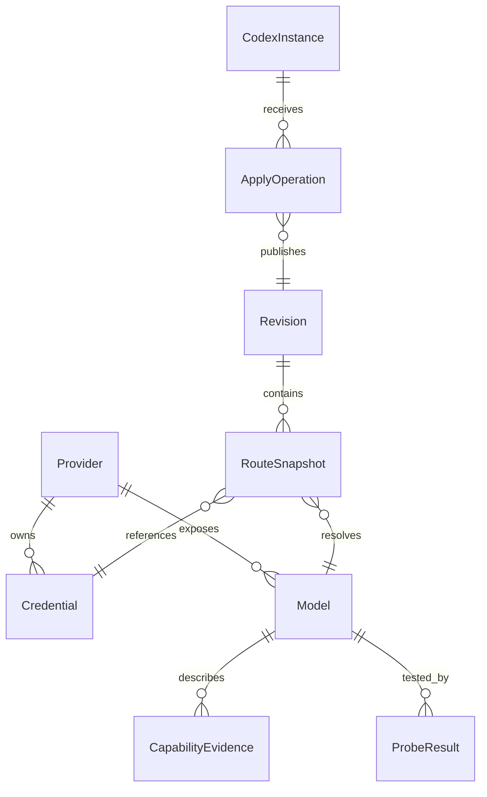

# 数据模型与接口契约

命名统一：持久化与 Rust 使用 snake_case，TypeScript DTO 使用 camelCase。

两种类型目前是**手工同步**：Rust 侧改了字段，`src/contracts/types.ts` 要跟着改，没有编译期约束（设计里计划由 Rust 类型生成 TS 类型，尚未实现）。改 IPC 契约时两侧一起改，并用 `pnpm typecheck` 与 `cargo test -p switch-core` 兜住。

## 1. 实体与关系



| 实体 | 核心字段 |
| --- | --- |
| Provider | id、name、endpoint、protocol、auth_kind、preset_id?、active_credential_id?、enabled、version、timestamps |
| Credential | id、provider_id、label、secret_ref、secret_version、masked_suffix、status、scope?、last_verified_at? |
| Model | id、provider_id、upstream_id、catalog_alias、display_name、protocol_override?、enabled、capability_revision、version |
| CapabilityEvidence | model_id、field_path、value_json、source_kind、source_ref?、observed_at、verification_status |
| ModelPolicy | context_limit?、output_limit?、compact_limit?、reasoning_default?、reasoning_mapping、input_policies |
| CodexInstance | id、app_path、cli_path、desktop_version、cli_version、config_root、startup_mode、compatibility_id |
| Revision | id、parent_id?、schema_version、content_hash、created_at、immutable manifest |
| RuntimePublication | instance_id、catalog_revision、policy_revision、endpoint_prefix、published_at；关联不可变 Revision |
| ApplyOperation | id、instance_id、plan_hash、idempotency_key、stage、expected_config_hash、written_hash?、revision_id、error? |
| ConfigOwnership | instance_id、key_path、baseline_presence、baseline_value、last_written_value、owner_revision |
| ProbeResult | id、provider/model/credential version、stages、latencies、capability_assertions、expires_at |
| ResponseBinding | response_id_digest、route_revision、credential_version、expires_at |
| DiagnosticEvent | timestamp、level、operation_id?、request_id?、stage、code、safe_message、safe_metadata |

Key 明文不进入 SQLite。`masked_suffix` 仅短尾号或固定掩码；短 Key 不暴露尾号。HTTP 自定义秘密 header 也用 secret_ref，不塞进 provider JSON。

ConfigOwnership 只保存本工具允许管理的非秘密字段；如果原值涉及秘密认证字段，改为加密备份引用，不能将其原文写进 baseline_value。目录修订与运行策略修订分开：同一目录下的兼容策略可热发布，目录能力改变使用新的 endpoint_prefix 并等待宿主重载。

## 2. 能力结构

```ts
type Support = 'supported' | 'unsupported' | 'unknown';
type EvidenceSource = 'provider' | 'official_docs' | 'registry' | 'user' | 'probe';
type InputKind = 'text' | 'image' | 'audio' | 'video' | 'pdf' | 'document';
type InputPath = 'native' | 'converted' | 'tool_read' | 'blocked';

interface CapabilityValue<T> {
  value: T | null;
  source: EvidenceSource;
  sourceRef?: string;
  observedAt: string;
  verification: 'declared' | 'verified' | 'failed' | 'stale';
}

interface ReasoningPolicy {
  support: Support;
  control: 'effort' | 'toggle' | 'budget' | 'none';
  allowedValues: string[];
  defaultValue: string | null; // null = 不主动指定，不向上游发 auto
  budgetTokens: number | null;
  mappingId: string | null;    // 已实现、版本化适配器映射
}
```

输入能力每项记录上游支持、网关支持、宿主支持、有效路径、可选 MIME、大小限制和转换 ID。`verified` 只对具体断言成立：一次小图片成功不能证明 20 MiB 图片成功；小输出测试不能证明最大上下文窗口。

发现结果与用户覆盖分开存储。刷新 `/models` 只更新发现层，展示差异；不会覆盖用户名称、上下文、推理映射和能力说明。冲突保存来源而不是简单最后写入覆盖。

`display_name` 是**目录里真正显示的那个名字**，因此默认带供应商前缀（`供应商/模型名`，规则与幂等性见 `domain::model::qualified_display_name`）：Codex 的模型菜单是一份扁平列表，原生模型与各供应商的模型同处一列，不带来源就分不出同名模型属于谁。前缀由核心统一补齐——发现值、保存模型、供应商改名三条写入路径都经过它；供应商改名后旧前缀就地替换而不是叠加。用户显式改过名字则原样使用，不再补前缀。

## 3. 唯一性与约束

- UUID/ULID 作为内部 ID；展示名允许重复，但列表同时展示 endpoint/供应商信息。
- `(provider_id, upstream_id, protocol)` 唯一，ID 精确保留大小写和 Unicode，不用小写归一化合并不同模型。
- `catalog_alias` 全局唯一、稳定、不含 API Key、URL 或邮箱；变更需迁移计划。
- 所有 Token 值为正整数或 null，不能为负、NaN、浮点或超出宿主整数范围。
- 推理默认值必须属于 allowedValues；支持未知时只允许“不指定”。
- 图片/音频开启必须有该宿主 schema 合法投影；视频/PDF 不写入 `input_modalities`。
- 删除被启用模型、供应商或凭据时，先显示依赖并生成停用计划；有活跃引用则延迟实际删除。
- optimistic version 用于 UI 并发编辑；相同记录被托盘/另窗口改变时返回 conflict。

## 4. IPC 约定

所有命令验证参数和调用窗口身份。长任务返回 operationId 并通过事件报告；取消不代表已提交事务可任意中断，阶段必须定义取消点。

命令名与 DTO 是壳无关的业务契约。React 通过 DesktopClient 调用，Tauri 的 invoke/listen 只出现在 transport 层；后端 handler 不承载配置/路由业务。未来若更换 Electron，仅增加受限 preload、主进程校验与 core-host 传输，不能顺带扩大命令权限。现在不实现第二套传输。

| 命令 | 主要输入 | 输出/副作用 |
| --- | --- | --- |
| `instances.detect` | 可选显式路径 | 实例列表，只读 |
| `providers.list` | filter、cursor | 脱敏分页结果 |
| `providers.save` | draft、expectedVersion | provider DTO；不应用 Codex |
| `credentials.add` | providerId、label、secret | ref / mask；仅本次传入秘密 |
| `credentials.replace` | credentialId、secret、expectedVersion | 新 secret_version，不覆写在途版本 |
| `credentials.select` | providerId、credentialId | 草稿修改；启用用 revision 发布 |
| `models.discover` | providerId、credentialId | 异步发现结果，不自动保存全部 |
| `models.save` | modelDraft、expectedVersion | 验证后的模型版本 |
| `probes.start` | target、stages、revision | operationId；明确网络副作用 |
| `probes.cancel` | operationId | 取消结果 |
| `config.inspect` | instanceId、cwd? | 配置层、有效值、冲突，不回秘密 |
| `apply.plan` | instanceId、draftRevision | 脱敏 diff、影响、预检、planHash |
| `apply.execute` | planId、planHash、idempotencyKey | operationId；过期/变更则拒绝 |
| `apply.status` | operationId | 当前阶段、证据、恢复动作 |
| `restore.plan` / `restore.execute` | instanceId、targetRevision | 同样先计划后执行 |
| `diagnostics.export` | scopes、redactionPreviewHash | 用户选择位置的脱敏包 |

不提供 `run_shell(command)` 或任意 `write_file(path,content)` 给 renderer。链接打开只允许经过校验的 http/https；文件定位只使用核心已登记的路径。

## 5. 状态事件

```ts
interface OperationEvent {
  schemaVersion: 1;
  operationId: string;
  sequence: number;
  phase: 'validating' | 'prepared' | 'committing' | 'awaiting_reload'
    | 'verified' | 'failed' | 'rolling_back' | 'restored' | 'conflict';
  revisionId?: string;
  messageKey: string;
  safeArgs: Record<string, string | number | boolean>;
  cancellable: boolean;
  timestamp: string;
}
```

窗口重新打开后先查 operation snapshot，再订阅大于 sequence 的事件，避免只靠 toast 丢失最终状态。事件具有有界保留，过旧 cursor 返回重新同步要求。

## 6. 错误契约

统一结构：`code, messageKey, safeDetails, retryable, recoveryActions, operationId?`。错误正文不直接复制上游响应；先截断、脱敏、转为分类说明。

| code | 中文反馈 | 恢复入口 |
| --- | --- | --- |
| CONFIG_CHANGED | 配置已被其他程序修改 | 重新读取并比较 |
| CONFIG_PARSE_FAILED | 配置文件无法解析 | 定位错误行、打开副本 |
| KEYSTORE_LOCKED | 系统凭据库暂不可用 | 解锁后重试 |
| CREDENTIAL_MISSING | 此 Key 的安全记录不存在 | 重新填写 |
| MODEL_PERMISSION_DENIED | 当前 Key 没有该模型权限 | 检查模型/更换 Key |
| CAPABILITY_UNSUPPORTED | 当前接入方式不支持此能力 | 查看字段说明 |
| CATALOG_SCHEMA_MISMATCH | 目录与当前 Codex 版本不匹配 | 兼容诊断 |
| DESKTOP_RELOAD_REQUIRED | 配置已提交，等待 Codex 重新加载 | 稍后/重启目标实例 |
| ROUTE_MISMATCH | 实际请求路由与选择不一致 | 停用新版本、恢复 |
| CONTINUATION_BOUND | 此续接仍绑定原凭据 | 继续原任务/新建任务 |
| PORT_IN_USE | 本地服务端口被占用 | 查看占用信息、生成改端口计划 |

## 7. 数据迁移与导入

数据库 migration 单调递增，每次升级前备份；升级失败回滚应用启动，不对旧库重复部分迁移。目录 schema 与 DB schema 分别版本化。稳定运行快照要保留其编译器版本。

P0 导出默认仅配置元数据和无秘密模板；导入先预览新增/覆盖/冲突，不允许导入任意可执行 auth.command 或安装路径。P1 加密导出采用审查过的 AEAD + 密码 KDF 格式，含版本、参数、随机 salt/nonce 和完整性校验；不自创加密算法。
