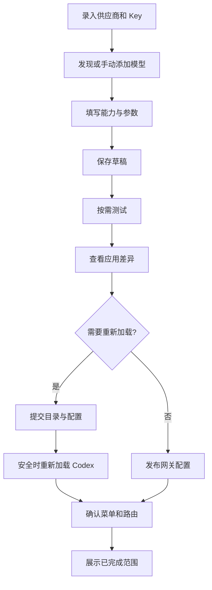

# 页面设计与关键流程

## 1. 信息架构

```text
Switchelp
├── 概览
├── 网关
│   └── 供应商详情：连接 / API Key / 模型
│       └── 模型编辑：基本信息 / 长度 / 输入与工具 / 思考 / 生效预览
├── Codex 配置
│   ├── 安装实例与有效配置
│   ├── 待应用差异
│   └── 备份与恢复
├── ── 扩展 ──
│   ├── 内容中心
│   ├── 工具管理
│   └── 插件中心
├── ── 诊断 ──
│   ├── 连接诊断
│   └── 日志
└── 设置（侧栏底部）
```

`网关` 这一页管的是**上游供应商与模型**（地址、Key、模型能力）。页名沿用产品方定的叫法；
底栏的「网关运行中 · 127.0.0.1:18765」指的是**本机代理进程**——同一个词在这一页有两层含义，
界面文案里要避免把它们混在一句里。

侧栏的分组标题（扩展 / 诊断）是**视觉分段**：不可点、不可折叠、不进 Tab 顺序（`aria-hidden`）。


全局顶部不放二级导航商城或账号入口。语言、主题、后台行为在设置中。模式状态始终可见：原生模式 / 第三方模式 / 等待加载，不要求用户理解内部 Bridge。

## 2. P01 首次接入

目的：建立正确目标实例，并完成第一条可用链路。

首屏是三个可返回步骤：“检测 Codex → 添加供应商和模型 → 测试并应用”。检测失败显示安装指引和手动定位，不自动下载 Codex；多个实例必须让用户选择，不能自动挑正在运行的任意同名程序。

检测结果包括版本、配置目录、是否运行、是否存在第三方管理痕迹。发现冲突时用户可先保存供应商，应用步骤暂停在冲突说明，不丢前面输入。首次流程允许跳过在线测试保存草稿，但不能将未测试模型显示为已验证。

完成页显示具体模型名和“在 Codex 模型选择器中选择”，附验证状态；没有真实加载证据时使用等待状态，而不是庆祝成功页面。

## 3. P02 概览

```text
┌ 侧栏 216 ────┬─────────────────────────────────────────────┐
│ Switchelp    │ 概览                         + 添加供应商    │
│ 概览         │ 当前实例 · 第三方模式 · 版本信息              │
│ 供应商       ├─────────────────────────────────────────────┤
│ 模型         │ 接入进度                    4 / 5 项已就绪    │
│ Codex 配置   │ ✓供应商 ✓API Key ○模型 ✓应用到 Codex ✓本地网关│
│ 连接诊断     ├─────────────────────────┬───────────────────┤
│ 日志         │ 当前配置                │ 连接状态          │
│              │ 服务商 A · Model X       │ 本地服务 已运行    │
│              │ 后续请求：工作 Key       │ 模型调用 已通过    │
│              │ [打开 Codex] [查看模型]  │ Codex 等待加载     │
│              ├─────────────────────────┴───────────────────┤
│              │ 供应商                          [管理全部]  │
│              │ A  2 Key / 3 模型          最近检测 2 分钟前 │
│              │ B  1 Key / 1 模型          尚未测试         │
│ 设置         ├─────────────────────────────────────────────┤
│ 待应用：2 个模型 等待 Codex 确认加载      查看差异  [应用并重启 Codex] │
│ （在「网关」页页头下方的一行：不是卡片，底边一条分割线与下面的内容分开； │
│   不吸底、不跨页常驻）                                                   │
└──────────────┴─────────────────────────────────────────────┘
```

主标题下只用一句话说明状态。当前配置卡显示本工具设置的默认路由，不谎称是 Codex 当前每个会话正在用的模型；有活跃请求证据时另列“最近请求使用”。

### 3.1 接入进度（2026-09-21 新增）

这一页最先要回答的是「我弄了哪些、还差哪些」，所以最上面一块是五步清单：
**供应商 → API Key → 模型 → 应用到 Codex → 本地网关**。

- 每一步的判据都是**可核实的观察值**，不是估算出来的进度：供应商数量、有 Key 的供应商数、
  模型数与纳入目录数、最近一次成功应用的阶段与目录版本、网关进程是否在跑。没有「大概完成」这种状态。
- 已完成的项是**事实**（绿勾 + 一句状态）；未完成的项**整块可点**，直接跳到能处理它的页面。
- 「有 Key」不等于「已验证」：这一步只说「填了」，验证结果在下面供应商那一栏里。
- 未完成的那一格渲染成 `button`，已完成的是 `div`。**两者必须长得一样**：全局 `button` 带
  `justify-content: center`，不覆盖它，网格唯一的轨道会在按钮里居中，整格内容（图标、标题、说明）
  一起右移十几像素——并排看就是「API Key 那一格左边距特别大」。做法见 `OverviewPage.module.css` 的
  `.step`（`grid-template-columns: minmax(0,1fr)` + `justify-content: stretch`）。
- 五格**等宽且等高**。等高要显式做两件事：`li` 与里面的格子都要撑满（grid 只拉伸 `li`，
  里面的按钮不跟着长，文字多的那一格会比旁边高、旁边几格底部空出十几像素，实测 110 vs 92）；
  文案也要控制在**一行**内——这一格曾经带一个目录版本号（`已核验加载 · rev_046731cc`），
  同一个值在下面「当前配置」卡已经有一个徽章，重复它只会把这一格撑成两行。

### 3.2 两栏卡片等高

「当前配置」与「连接状态」以前按各自内容高度塌下来（`align-items: start`），底边差着几十像素，
看上去不工整（用户点名的就是这个）。现在两栏等高（`align-items: stretch`），卡片内容是 flex 纵向排列，
动作行用 `margin-top: auto` 钉在卡片底部，多出来的空间落在中间。

无供应商：一张“添加第一个供应商”空态；本机代理异常：状态卡变为具体错误与启动/诊断动作；有未应用修改：**只在网关页**、页头下方的一行（见 §7）。首页不展示没有可靠来源的余额、成功率和 Token 节省统计。

## 4. P03 网关：供应商列表与详情

列表页：标题、搜索框、状态筛选、添加按钮，默认显示用户已添加供应商；“从预设添加”是创建入口，不把几十家未配置厂商挤进日常列表。

点击一行进入列表/详情双栏；详情顶部为名称、endpoint、状态，菜单有停用/删除。详情页只放事实（API 地址、协议、认证方式）与该供应商的模型表；Key、获取模型、测试连接都在弹窗里，同一件事只有一个入口。

**供应商的录入、Key、模型与测试连接都在同一个弹窗里**（「添加供应商」/「编辑配置」），版面收成一条直线：Base URL → API 格式 → API Key → 模型列表。上一版把认证方式、协议说明、备注、凭证池、连接检查全铺在一屏里，接入一家供应商要在两组概念之间来回看，这一版按「一次做一件事」重排：

1. **标题是纯文字**（新建时「添加供应商」，已保存时供应商名）；名称是表单里的第一个字段，带自己的说明。标题里塞一个无边框输入框看着像标题、其实是控件，没人会去点它。
2. **高频三件套固定在首屏**：Base URL、API 格式（Responses / Chat Completions）、API Key。多出来的东西（备注、无认证、启用/停用、删除供应商）都收进标题右侧的「更多」菜单，不占版面——启用开关挂在标题栏时会被当成「这个弹窗的开关」。
3. **模型列表带两条加入路径**：从上游一次拿回来（「获取可用模型」），或者手工填一个（「添加模型」）。两条路的结果都落在同一张表里。
4. **每个模型四个动作**：测试连接、编辑、删除、纳入/移出 Codex 目录，全在行内，不用回详情页找入口。

Key 只有一个**当前 Key**：输入框留空表示不动它（掩码只作为占位符显示），写入新值则表示替换——秘密值换了、编号不变，指向它的配置继续有效。一家供应商有多个 Key 时，额外出现一个「当前 Key」下拉用于切换；没有第二个 Key 就不显示这一行。

**点「获取可用模型」会自动先落库**：地址与 Key 是这次请求的前提，让人先点一次「保存」再点「获取」是白走一步。已经保存过、字段也没改过时不写库——白写一次还会撞上版本冲突。

连接表单：

| 字段 | 必填 | 规则 |
| --- | --- | --- |
| 名称 | 是 | 1–64 字符；标题里直接编辑，显示名不参与路由 |
| Base URL | 是 | 完整 URL；HTTPS 默认；提示里写清不要带 `/chat/completions` 或 `/responses` |
| API 格式 | 是 | Responses / Chat Completions；**Anthropic Messages 尚未实现**，界面直说；选 Chat Completions 时明确标出它的适配器还没通过工具调用验证（实验） |
| API Key | 新建时是 | 留空＝不动已有 Key；写新值＝替换。Key 只进系统凭据库，界面只显示掩码 |
| 备注 | 否 | 「更多」菜单里展开；最大 500 字符 |
| 无认证 | 否 | 「更多」菜单里切换；只有本机地址（127.0.0.1 / localhost）可用，远程地址时禁用并说明原因 |
| 自定义 headers | 否 | 高级区；敏感值安全存储；禁止覆盖内部路由保护字段 |
| 代理与超时 | 否 | 高级区；默认使用应用网络策略 |

底部「保存」。**版本号取宿主列表里最新的那一份**，并在真的撞上冲突时重读一次再写：核心按版本号拒绝覆盖别人的修改，而「把新 Key 设为当前 Key」这一步本身就会把版本推高——攥着创建时的版本号去写，用户只会看到一句没有原因的「保存失败」。保存后不自动发探测；URL 改变使旧探测结果 stale。**测试连接在模型行上**（只读探测，不发真实生成），结论以右下角 Toast 说出**哪家供应商的哪个模型**成功或失败，失败时带上原因；成功 5 秒后自己收起，失败留着等人处理。

**调度策略只有「固定当前 Key」**：核心层每家供应商只有一个当前凭据，且跨 Key 重试被硬编码禁止，所以不做轮询、失败切换或 429 冷却的选项——做出来会是个假开关。

**所有一次性反馈都走全局 Toast（右下角悬浮）**，不在弹窗底部摆横幅：横幅跟着布局走，用户填完一屏之后不会往那儿看。判别规则见组件规范（动作的结果走 Toast、页面状态留在内联条）。「更多」菜单渲染在 body 上的 portal 里并用固定定位——就地绝对定位会被容器的 `overflow` 裁掉或撑出滚动条（模型表格的「更多」当初正是把表格撑出了上下滚动）。

**「获取可用模型」的结果是一个勾选弹窗，不是逐条「添加」**：上游返回的是一份清单，加十个模型点十次弹窗是最难受的地方。默认全选未添加的，已经在库里的显示「已添加」且不可勾选，并说明**本次用哪一组默认长度**（上游不返回上下文窗口）。确认后一次写入，随后逐个打开编辑核对——默认值不是「猜对了」，只是「先能用」。手工「添加模型」打开同一个模型表单。

「添加模型」弹窗三件事：模型 ID、上下文窗口、最大输出 Token。显示名不在这里——它在 Codex 菜单里的名字默认是**「供应商/模型 ID」**（如 `qiyuan/deepseek-v4.1`）：菜单是扁平的一份，原生模型和各供应商的模型排在一起，不带上来源就认不出同名模型属于谁。想改名去整页编辑器（改名后系统不再补前缀，那是用户自己的选择）。**「智能配置」**开关打开时，留空的长度按推荐默认值补齐（并在占位符里写明补什么），关掉则留空表示「未声明」；它不替用户声明能力。能力项（输入类型、模型能力、推理档位）收在默认折叠的「高级配置」里：勾选＝声明支持，取消勾选＝明确不支持，没点过的项保持「未确认」并原样写回——未知不能被渲染成不支持，否则交集原则会把这个能力从 Codex 目录里灭掉。推理档位是一条可增删的集合（点一下设为默认），没有整页编辑器里那套预算/toggle 分支；推理参数映射是只读的：它写在网关的版本化适配器里。「重置表单」把这一层填的内容清回初始值。

带生效预览的整页模型编辑器保留给深度修改：从模型目录页（或供应商详情的模型表）的「编辑」进入，侧栏导航在编辑器有未保存内容时先确认再离开。

删除供应商弹窗列出 N 个模型、N 个 Key 以及正在使用情况，确认后连同 Key 与模型一起删除并撤销安全条目。恢复与安全凭据删除是可追踪操作，不能只移除列表行。

## 5. P04 模型目录

工具栏：搜索名称/精确 ID，供应商筛选、可用/未测试筛选、添加模型。列表列定义见组件规范，支持排序：名称、供应商、最近测试；不按伪造质量分排名。

行主操作“编辑”，次操作“测试”，菜单“复制 ID、纳入/移出 Codex、删除”。选中多行出现批量操作条，显示跨几家供应商、测试数和调用提示。

模型状态包括“未选择用于 Codex”，不能所有发现到的模型都自动塞进原生菜单。支持只保留常用模型，减少 Codex 菜单噪声。

## 6. P05 模型编辑器

模型有两层编辑入口，共用同一套控件：

- **「添加模型」弹窗**（供应商弹窗里的高频路径）：只问上游模型 ID、上下文窗口、最大输出 Token，能力项收在折叠的「高级配置」里。
- **整页编辑器**（模型目录页或供应商模型表行的「编辑」）：同样三个字段，外加整页才放得下的东西——显示名称、供应商、压缩阈值、纳入目录开关。

两处的控件形状必须一致（勾选单元格、档位 chip 都是共用组件）：从弹窗进来的人不该看到第二套交互。

```text
模型 / 自定义代码模型
────────────────────────────────────────────────────
基本信息
供应商 [A]            显示名称 [代码模型] ⓘ

上游模型 ID ⓘ [vendor/model-x]

长度限制
上下文窗口 ⓘ [128000]    最大输出 Token ⓘ [8192]
上下文包含历史、指令、工具信息与输出预留

输入类型
[✓ 文本 🔒] [ 图片] [ 音频] [ 视频] [ PDF]
勾选＝声明这个模型支持这种输入；没点过的项保持「未确认」

模型能力
[ 函数工具] [ 并行工具]

推理等级（从低到高）
[＋]

Codex 目录
加入待应用的 Codex 模型目录 ⓘ  [开关]

▸ 高级配置（压缩阈值）
────────────────────────────────────────────────────
尚未修改　保存后到「Codex 配置」页生成差异并应用  [取消] [保存]
```

版面是一列：页头固定，**只有中间字段区滚动**，操作条钉在卡片底部——底栏不跟着内容滚，填到一半不必先滚到底才能保存。分组之间用分隔线，第一个分组上面不留线。

**没有「生效预览」这一栏**。它把每个字段再说一遍，读的人还得先理解「Codex 目录 / 网关请求 / 三层交集」这套词汇。这些信息改为挂在每个字段自己的「ⓘ」上——就在要填的那个值旁边，一句话说清它落在哪里、会有什么后果：

- 显示名称：出现在 Codex 模型选择器里；改它不动上游请求用的 ID。默认带「供应商/」前缀，这块菜单里原生模型与各供应商的模型是同一列，去掉前缀就认不出同名模型属于谁
- 上游模型 ID：请求里发出的精确 ID；改动会生成新的目录身份
- 上下文窗口：进 Codex 目录，决定何时压缩历史
- 最大输出：每次请求的上限，由本机网关按你填的值收口
- 压缩阈值：留空按上下文与输出自动建议
- 纳入目录：应用配置时才会写进 Codex 的模型菜单

**页尾只有「取消」和「保存」**。不再有「保存草稿 / 保存并查看应用差异」两条几乎一样的路——后者只是保存完顺带跳页，而这可以由保存后的提示与「Codex 配置」页承担。

能力项是**勾选**，不是三态下拉：勾＝声明支持，不勾＝声明不支持，**没点过的项保存时原样写回**。核心的能力是三态（支持 / 不支持 / 未知），未知不能被渲染成不支持——把未知写成不支持会通过交集原则把这个能力从 Codex 目录里灭掉，所以界面不摆一个「未知」选项让人误以为要逐项做决定。文本是链路底线：勾着、锁着、点不动。PDF 与视频当前链路发不出去：可见、灰态、点不动（需求 R22），勾了也不会出现在原生能力里。

思考只声明「档位式」：默认只有一个加号，加一个档位才代表这个模型有档位，点某个档位把它设为默认；一个都不加＝不声明思考。核心还支持「开启 / 关闭」与「Token 预算」两种控制方式，但那两种不在这页的编辑范围内——**已保存的声明在用户没动过这一节时原样保留**，并在下面写明它是什么，不能因为打开一次页面再保存就把它抹掉。

长度字段旁解释「上下文包含历史、指令、工具信息和输出预留」；输出字段解释「设定请求上限，不保证模型输出恰好这么长」。最大输出不得用滑杆作为唯一输入，精确数值优先。

保存前校验：模型 ID 不空、输出小于上下文、默认档位属于已声明集合、目录投影可生成。错误就地显示。

## 7. P06 Codex 配置与应用

**共存模式卡片放在实例卡之前**：它决定「应用」把模型写到哪里（用户真实的 `~/.codex`，还是应用数据目录里的托管 profile），不是附属设置。卡片上有：标题与语义色状态徽章（已开启＝成功色、未开启＝中性）、一句解释、`bridge` 与托管 profile 两个路径、以及「从原生配置重新同步」（只在开启时出现——底子是开启时复制的那份快照，之后原生配置的改动要手动带过来）。

**意图与事实分开显示**：开关只说明我们记下了选择。卡片下方另有一行说宿主此刻的状态——「正以共存模式运行」/「已开启，但当前这个 Codex 不是以共存模式启动的（你自己从 Dock 打开过它）」/「无法确认宿主是否以共存模式运行」。第三种不是含糊话：拿不到进程启动时间就是拿不到，不能拿「大概没有」当结论。不具备接管前提（没有 CLI、平台不支持、bridge 没装好）时开关禁用，并写明原因。

**差异弹窗按模式换说法**：替换菜单那套说「Codex 的模型菜单会被替换」并列出本次会出现的模型；共存模式下换成「菜单里会同时有官方模型和我们发布的模型」，并说明这次写的是托管 profile、原生配置不动。**共存模式下「还原为原生」按钮禁用**并说明理由：那份配置我们从来没写过，没有可还原的内容；退出共存用开关。

顶部实例选择器和三项状态：已保存版本、已发布版本、Codex 已观测版本。主区是“当前接入方式”“默认模型”“受管理字段”“最近备份”。高级区展示脱敏 TOML 和配置层来源，只读默认。

“查看差异”页面分组：供应商路由、模型目录、请求策略、需要重新加载的项目。每组列出改前/改后和作用范围；顶部固定目标应用、配置路径与版本。底部主按钮根据计划写“应用”或“应用并重新加载”。

执行页显示校验→准备→提交→重新加载→核验。处于不可安全取消的提交阶段，取消按钮变为不可用并说明短暂原因；不是把关闭窗口等同于取消任务。

忙碌实例给“保存并稍后重新加载”和明确的重启操作；不默认中断正在生成的任务。原生恢复显示撤销字段与会保留的本工具供应商，冲突时转三方比较。

### 7.0 待应用入口：在网关页页头下方，不在页面底部

配好供应商与模型之后，生效只差「应用 + 重启 Codex」这一步。这个入口的位置经过两轮改动，结论是：

- **只在网关页出现**（页头下方一条普通行），不跨页常驻、不吸底。跨页吸附的版本会在每一页盖住一行内容，
  还容易被读成全局状态栏；而用户是在网关页配完东西的，入口就该在这一页。
- **它不是一个卡片**：只是「有几个模型没生效」这行事实加两个动作，底边一条分割线与下面的内容分开。
  做成卡片会跟真正的卡片（供应商详情）抢层级，还会跟下面的两栏贴在一起像同一个块。
- 两个动作：「查看差异」去 Codex 配置页看完整事务状态；主按钮按状态是「应用并重启 Codex」
  （还没写完配置）或「Codex 已经重启了」（写完了、只等宿主回执）。
- 「有几个模型待确认加载」这个事实仍然同时出现在顶栏胶囊、概览页与底栏，四处文案同源——
  改口径要四处一起改（见 [需求](../01-product-requirements.md) 的 US-01）。

### 7.1 重启宿主：结论必须来自观察，不能来自“命令发出去了”

Codex 只在启动时读 `config.toml`，所以写完配置必须重启它，模型才会进菜单。这一步最容易出的错是**假成功**：旧进程还没退干净就执行启动命令，于是它只是把旧进程拉到前台——配置没重读，但一切看起来都成功了。固定 `sleep` 挡不住，因为退出耗时不是常数。

实测依据：`osascript -e 'quit app "<不存在的路径>"'` 与 `open -a "<不存在的路径>"` **都返回 0**，退出码不携带任何信息。唯一可靠的信号是进程在不在（`pgrep -x`）。

所以重启按四步走，每步都等到观察到结果为止：

1. 请求优雅退出（macOS 走 AppleScript），轮询进程直到消失或超时。
2. 优雅退出没成时**升级为发信号**（`killall -TERM`），再等一轮。macOS 下“优雅退出没成”多半不是应用不肯退，而是系统没有授予我们向它发送 Apple 事件的权利——授权是按（发起方, 目标）成对授予的，新装的应用默认没有。授权缺失是环境问题，不该让整个功能失效。
3. 只有在确认旧进程已经消失之后才执行启动命令。
4. 启动后轮询进程直到它回来。

界面按观察到的事实说三种不同的话，因为用户接下来要做的事不一样：重启成功（可以去菜单里找模型）／旧进程仍在运行、没能重启（需要他自己退出）／退出了但没起来（需要他自己打开）。用了兜底信号时额外提醒未保存的对话可能丢失——这与“不默认中断正在生成的任务”并不矛盾：先优雅后强杀，且明确告知。

## 8. P07 连接诊断

先选供应商、模型、Key、协议/修订；默认最小文本+流式+工具检查，图片/推理扩展按用户勾选。开始按钮旁说明合成测试与可能费用。结果以阶段时间线显示，失败后不继续无意义的后续项目。

右侧“建议处理”使用结构化错误码；底部“复制诊断摘要”。无网络、TLS 失败、401、模型不存在、只支持 Chat、工具未返回、SSE 中断、Codex 未加载分别给可执行建议，不统一显示“Key 无效”。

连接测试不包含“清理认证/清空缓存/重装 Codex”等不相称自动动作。

## 9. P08 日志

按时间、级别、供应商、请求/应用事务筛选；默认显示最近 200 条并分页。表格字段是时间、类别、目标、结果、耗时；详情抽屉展示安全元数据和关联事件。全文搜索仅在脱敏字段中进行。

“清空日志”只影响本工具诊断；不删除 Codex 历史。导出打开本地保存对话框，先展示脱敏包内容清单。用户离线时日志仍可读。

诊断包的**范围**是一排勾选单元格（与其他多选同一套形状，见 [组件规范 §10](03-components.md)），
不是「原生勾选框 + 一行文字」；改动范围会让已生成的预览作废，避免导出的包与预览清单不一致。

## 10. P09 设置与托盘

设置分组：外观/语言、后台运行、Codex 实例、网络、日志保留、备份与更新、关于。危险操作与日常开关分开，不把恢复配置和主题开关放同一行。

托盘菜单：当前模式/服务状态、打开 Switchelp、已配置固定 Key 快捷选择、打开 Codex、暂停新请求、退出。模型切换只对未来请求默认值生效；不能声称已改变当前任务模型。快捷动作沿同一后端事务，不能写第二套配置逻辑。

## 11. 流程约束



保存、测试、应用可顺着同一页面完成，但语义不合并。允许保存未验证草稿；不允许通过 UI 把未知能力自动标成已验证。
